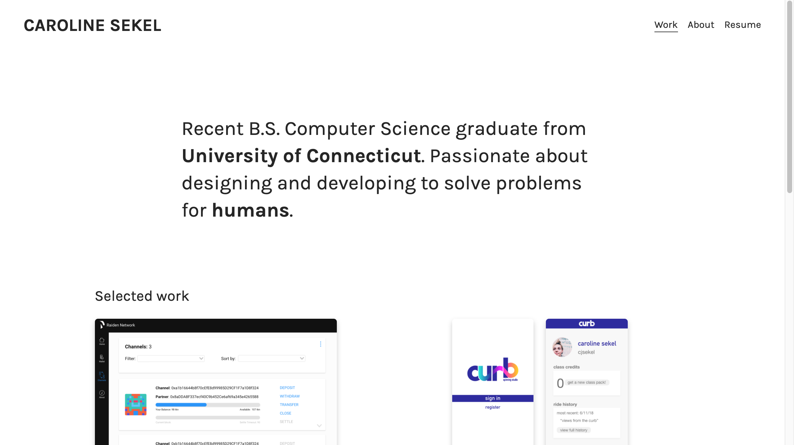

# portfolio
My personal portfolio website 

##Summary
I built this portfolio site using HTML, CSS, and JQuery to showcase some of my design and development projects. You can view the live site [here](https://carolinesekel.github.io/portfolio/).

##Built with
*HTML
*CSS
*JQuery

##Acknowledgements
Shout out to Marius Craciunoiu who's awesome [tutorial](https://medium.com/@mariusc23/hide-header-on-scroll-down-show-on-scroll-up-67bbaae9a78c) helped me build my header.
